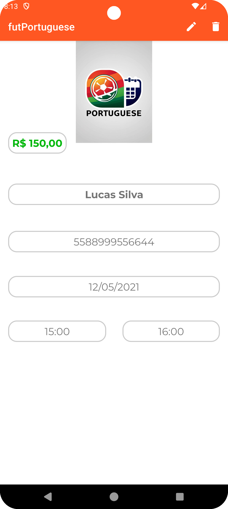

[EN]
# Soccer Field Game Manager - futPortuguese

### This is an Android app developed to manage soccer field games. The project includes features that allow users to create, view, edit, and delete information about games and players in a practical and intuitive way.
#

[PT]
# Gerenciador de Jogos de Campo Society - futPortuguese

### Este é um aplicativo Android desenvolvido para gerenciar jogos de campo society. O projeto inclui funcionalidades que permitem criar, visualizar, editar e excluir informações sobre jogos e jogadores de forma prática e intuitiva.
#
[EN]
### To access the app, you can download it from this link (Remember to enable the option called "Install apps from unknown sources" or "Unknown sources"):
https://drive.google.com/file/d/1PacAkUk-Ll4LgFwWluTQtnshoTImzb3Y/view?usp=sharing

[PT]
### Para ter acesso ao aplicativo , pode baixa-lo nesse link(Lembre-se de habilitar a opção chamada "Instalar aplicativos de fontes desconhecidas ou Fontes desconhecidas") > https://drive.google.com/file/d/1PacAkUk-Ll4LgFwWluTQtnshoTImzb3Y/view?usp=sharing

  
  
  
  
  
  

_______________________________________________________________

[EN]

# Features

Game Registration: Uses a dedicated form in a new activity to create and save game details.

Game Viewing: Saved games are displayed in a table format, using a RecyclerView for dynamic and efficient display.

Data Editing: It is possible to edit player information or game details directly in the app.

Game Deletion: Remove registered games when necessary.

Quick Access: A Floating Action Button (FAB) allows easy navigation to the game registration screen.
#
[PT]
# Funcionalidades

* Cadastro de jogos: Utiliza um formulário dedicado em uma nova activity para criar e salvar os detalhes dos jogos.

* Visualização de jogos: Os jogos salvos são exibidos em formato de tabela, utilizando uma RecyclerView para exibição dinâmica e eficiente.

* Alteração de dados: É possível editar as informações dos jogadores ou detalhes dos jogos diretamente na aplicação.

* Exclusão de jogos: Remova jogos cadastrados quando necessário.

* Acesso rápido: Um Floating Action Button (FAB) permite navegar facilmente para a tela de cadastro de jogos.

________________________________________________________________

[EN]
# How it Works

Home Screen: Displays the table of registered games in a RecyclerView.

Game Registration: Click the FAB to open the form and fill in the game and player information.

Data Management: By clicking on an item in the table, you can access options to edit or delete the data.
#
[PT]
# Como funciona?

* Tela inicial: Apresenta a tabela de jogos cadastrados em uma RecyclerView.

* Cadastro de jogo: Clique no FAB para abrir o formulário e preencher as informações sobre o jogo e os jogadores.

* Gerenciamento de dados: Ao clicar em um item da tabela, você pode acessar opções para editar ou excluir os dados.

________________________________________________________________

[EN]
# Technologies Used

Language: Kotlin

Main Components: RecyclerView, Floating Action Button, Activities

Architecture: Followed best Android development practices for modularity and maintainability.

[PT]
# Tecnologias utilizadas

* Linguagem: Kotlin

* Componentes principais: RecyclerView, Floating Action Button, Activities

* Arquitetura: Segui boas práticas de desenvolvimento Android para modularidade e manutenção.

________________________________________________________________
[EN]

# How to Contribute

* Feel free to open issues or submit pull requests with improvements and suggestions for the project.
#
[PT]
# Como contribuir

* Sinta-se à vontade para abrir issues ou enviar pull requests com melhorias e sugestões para o projeto.
